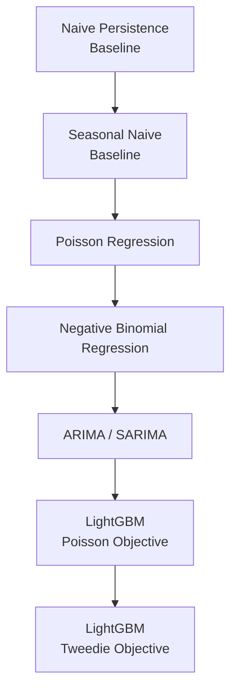

# Forecasting Political Violence in Myanmar Using Python
## A Time-Series Analysis of ACLED Conflict Events, January 2021–June 2025

### Project Overview

This project explores whether historical patterns of political violence in Myanmar can be used to forecast future conflict-event frequency using statistical time-series and count-data models in Python.

The analysis uses event-level data from the Armed Conflict Location & Event Data Project (ACLED) covering January 2021 to June 2025. The dataset contains 83,114 recorded events across 31 variables. Following data validation and cleaning, the project transforms individual conflict-event records into regional and national monthly time series, examines the statistical properties of conflict-event counts, and experiments with Negative Binomial regression and Seasonal ARIMA (SARIMA) models.

Rather than treating model-generated forecasts as inherently reliable, the project emphasizes model diagnostics, out-of-sample evaluation, benchmarking, uncertainty, and methodological limitations.

The analysis demonstrates an important forecasting lesson:

> A model's ability to produce plausible-looking future predictions does not establish that those predictions are accurate or superior to simple forecasting rules.

In particular, a six-month historical holdout test showed that the exploratory SARIMA model performed substantially worse than a simple naive persistence forecast. The project therefore serves both as an applied conflict-data analysis and as a foundation for more sophisticated forecasting using regional panel data, machine learning, spatial conflict dynamics, richer predictors, and repeated rolling out-of-sample validation.


### Research Question

The central question is:

> To what extent can historical patterns of political violence in Myanmar help predict the number of conflict events occurring in subsequent periods?

Supporting questions include:

* Are Myanmar's monthly conflict-event counts overdispersed?
* Do previous conflict levels contain useful information about subsequent violence?
* Can SARIMA capture temporal dependence and seasonality in national conflict-event counts?
* Does a SARIMA model outperform a simple naive forecast on genuinely unseen observations?
* How uncertain are six-period-ahead forecasts?
* Do model residuals retain systematic temporal structure?
* What information remains unexplained by simple national time-series models?
* Could regional, actor, event-composition, spatial, and contextual predictors improve forecast performance?


### Data

The analysis uses ACLED event-level observations for Myanmar covering:

January 2021 – June 2025

The source dataset contains:

$$ 83,114\text{ event records} $$

and:

$$ 31\text{ original variables}. $$

Each row in the original dataset represents an individual recorded ACLED event.

Selected variables used during data preparation include:

* event_date
* event_id_cnty
* event_type
* fatalities
* admin1
* latitude
* longitude
* geo_precision

Initial validation identified:

* Duplicate event IDs: 0
* Missing fatality values: 0

The absence of duplicate event_id_cnty values provides additional confidence that individual events were not inadvertently counted more than once during aggregation.

The event-level dataset was subsequently cleaned and aggregated for regional and national time-series analysis.


### Data Preparation

The preparation process included explicit validation of required variables, duplicate event IDs, date parsing, missing values, numeric conversion, categorical variables, and monthly continuity.

A simplified representation of the cleaning logic is:
```python
df = pd.read_csv("myanmar_acled_2021_2025.csv")

df["event_date"] = pd.to_datetime(
    df["event_date"],
    errors="coerce"
)

df = (
    df
    .sort_values("event_date")
    .reset_index(drop=True)
)
```
Geographic numeric variables were converted without automatically replacing missing coordinates with zero:

```python
geographic_columns = [
    "latitude",
    "longitude",
    "geo_precision",
]

for column in geographic_columns:
    if column in df.columns:
        df[column] = pd.to_numeric(
            df[column],
            errors="coerce"
        )
```
This distinction is important because latitude or longitude equal to zero represents an actual geographic location and should not be used as a substitute for missing spatial information.

Fatalities were converted separately:
```python
df["fatalities"] = pd.to_numeric(
    df["fatalities"],
    errors="coerce"
)
```
In the observed dataset, no missing fatality values were detected.

Categorical and temporal variables were then prepared:
```python
df["event_type"] = df["event_type"].astype("category")
df["admin1"] = df["admin1"].astype("category")

df["year"] = df["event_date"].dt.year
df["year_month"] = df["event_date"].dt.to_period("M")
```
The data were subsequently aggregated into ADMIN1-month observations, including total events, fatalities, and major forms of political violence:
```python
monthly_summary = (
    df
    .groupby(
        ["year_month", "admin1"],
        observed=True
    )
    .agg(
        total_events=("event_id_cnty", "nunique"),
        total_fatalities=("fatalities", "sum"),
        total_battles=(
            "event_type",
            lambda x: (x == "Battles").sum()
        ),
        total_explosions=(
            "event_type",
            lambda x:
            (x == "Explosions/Remote violence").sum()
        ),
        total_violence_civilians=(
            "event_type",
            lambda x:
            (x == "Violence against civilians").sum()
        ),
    )
    .reset_index()
)

monthly_summary["ds"] = (
    monthly_summary["year_month"]
    .dt
    .to_timestamp()
)
```
Using observed=True means that this aggregation retains ADMIN1-month combinations actually represented in the source events rather than implicitly constructing unobserved categorical combinations.

The resulting dataset contained:

$$ 945\text{ observed ADMIN1-month combinations}. $$

For the preliminary national analysis, regional observations were then aggregated:
```python
national_monthly = (
    monthly_summary
    .groupby("ds", as_index=False)[
        ["total_events", "total_fatalities"]
    ]
    .sum()
    .sort_values("ds")
    .reset_index(drop=True)
)
```
The resulting national series contains:

$$ 54\text{ monthly observations} $$

covering January 2021 through June 2025.

The monthly sequence was also checked explicitly for missing calendar months before time-series modeling.


### Exploratory Statistical Analysis
#### Overdispersion

Conflict events are count data: the outcome takes non-negative integer values such as 0, 1, 2, 100, or 2,000 events.

A preliminary diagnostic compared the mean and variance of monthly event counts.

The resulting descriptive statistics were:
| Variable | Monthly Mean | Monthly Variance | Variance / Mean |
| :--- | :--- | :--- | :--- |
| Conflict events | 1,539.15 | 93,529.49 | 60.77 |
| Fatalities | 1,586.17 | 319,255.46 | 201.27 |
For a standard Poisson process:

$$ Var(Y)=E(Y) $$

The observed variance substantially exceeds the mean for both outcomes.

For conflict events:

$$ \frac{93,529.49}{1,539.15} = 60.77 $$

while for fatalities:

$$ \frac{319,255.46}{1,586.17} = 201.27 $$

These results indicate very strong unconditional overdispersion relative to a simple Poisson benchmark.

This does not, by itself, prove that a particular regression model must follow a Negative Binomial distribution. Trends, seasonality, structural changes, omitted predictors, changing conflict intensity, and other processes may also inflate unconditional variance.

Nevertheless, the result indicates that a simple equidispersed Poisson assumption is unlikely to adequately characterize the unconditional national monthly data.


### Model 1 — Negative Binomial Regression

A preliminary Negative Binomial model examined whether the previous month's conflict events and fatalities were associated with the current month's event count.

The predictors were generated using:
```python
national_monthly["lag_events_1"] = (
    national_monthly["total_events"]
    .shift(1)
)

national_monthly["lag_fatalities_1"] = (
    national_monthly["total_fatalities"]
    .shift(1)
)
```
The model specification was:

$$ Events_t = f(Events_{t-1},Fatalities_{t-1}) $$

The analysis used a discrete Negative Binomial maximum-likelihood model to examine whether lagged conflict events and fatalities were associated with subsequent monthly event counts. This implementation attempts to estimate the dispersion parameter (α) from the observed data. 

#### Preliminary results

The model produced the following approximate coefficient estimates:
| Parameter | Estimate |
| :--- | :--- |
| Intercept | 7.1982 |
| Events \(t-1\) | 0.0001 |
| Fatalities \(t-1\) | −0.0000316 |
| Dispersion \(α\) | 1.0513 |

However, the optimization failed to converge and the Hessian could not be inverted, so standard errors, confidence intervals, and p-values were not considered reliable. The model is therefore treated as an exploratory benchmark rather than a validated inferential or forecasting model.

Rather than hiding this unsuccessful result, it provides an important methodological finding:

> A statistically plausible model family does not guarantee that a model can be estimated reliably from a short national time series.

With only 53 usable lagged monthly observations and substantial conflict-event variability, the national-level specification provides limited information for estimating a richer count-data process.

It also reinforces the rationale for eventually moving toward an ADMIN1-level panel, where substantially more observations and regional variation are available.


### Model 2 — SARIMA

A Seasonal Autoregressive Integrated Moving Average model was subsequently explored to capture temporal dependence, changes through time, and possible annual seasonality.

The exploratory specification was:

$$ SARIMA(1,1,1)\times(1,1,1)_{12} $$

implemented as:
```python
model = SARIMAX(
    timeseries_data,
    order=(1, 1, 1),
    seasonal_order=(1, 1, 1, 12),
    enforce_stationarity=False,
    enforce_invertibility=False,
)

sarima_results = model.fit(disp=False)
```
The 12 represents a potential annual seasonal cycle in monthly observations.

The final model fitted to January 2021–June 2025 produced:

| Parameter | Estimate | p-value |
| :--- | :--- | :--- |
| AR(1) | −0.2976 | 0.750 |
| MA(1) | 0.4966 | 0.529 |
| Seasonal AR(12) | 0.0405 | 0.933 |
| Seasonal MA(12) | −0.1048 | 0.818 |

The model returned:

$$ AIC=362.57 $$

and:

$$ BIC=369.05. $$

None of the individual AR or MA parameters was statistically significant at conventional thresholds.

Statistical significance is not equivalent to forecasting performance, and insignificant individual coefficients do not automatically invalidate a time-series forecasting model. Nevertheless, the estimates reinforce the need to question whether the chosen seasonal structure is unnecessarily complex relative to the short series.

This concern is strengthened by a Statsmodels warning generated during historical backtesting:

Too few observations were available to estimate starting parameters for the seasonal ARMA component, so initial seasonal parameters were set to zero.

The training sample used in the holdout exercise contained only 48 months, corresponding to approximately four annual cycles.

Accordingly, the specification should be treated as an exploratory SARIMA benchmark rather than an optimized or final model.


### Preliminary Six-Month Forecast

After evaluating the model historically, SARIMA was refitted on the complete January 2021–June 2025 national series and used to generate forecasts for July–December 2025.

The point forecasts and approximate 95% model-based intervals were:

| Month | Forecast | Approx. 95% Lower Bound | Approx. 95% Upper Bound |
| :--- | :--- | :--- | :--- |
| July 2025 | 1,455.80 | 1,131.12 | 1,780.47 |
| August 2025 | 1,420.22 | 913.29 | 1,927.15 |
| September 2025 | 1,218.59 | 590.95 | 1,846.23 |
| October 2025 | 1,337.72 | 606.18 | 2,069.27 |
| November 2025 | 1,520.63 | 698.99 | 2,342.28 |
| December 2025 | 1,437.48 | 534.47 | 2,340.49 |

The central forecasts suggest a decline through September, followed by some recovery in October and November and a modest decline in December.

However, these month-to-month differences should not be interpreted as strong evidence that the model has identified a reliable future conflict trajectory.

The uncertainty intervals widen substantially with forecast horizon.

For July:

$$ 1,131-1,780 $$

whereas by December:

$$ 534-2,340. $$

The December interval therefore encompasses dramatically different possible conflict environments.

This widening uncertainty illustrates an important characteristic of multi-step conflict forecasting:

Uncertainty compounds as the forecast horizon increases, particularly when a short historical series is used to estimate a relatively complex seasonal model.

The forecasts should therefore be treated as preliminary model outputs rather than precise predictions of future violence.


### Model Diagnostics

The evaluation distinguishes in-sample fit from out-of-sample forecasting performance. 

For descriptive purposes, the fitted SARIMA model produced an in-sample RMSE of:

$$ \boxed{498.86} $$

However, in-sample RMSE remains a secondary diagnostic because the model is being evaluated against observations that contributed to fitting its parameters.

The more important test withheld the final six observed months:

Training:
January 2021 – December 2024

Test:
January 2025 – June 2025

SARIMA therefore had to forecast observations it had not been allowed to see during estimation.

The actual and predicted values were:

| Month | Actual Events | SARIMA Forecast | Naive Forecast |
| :--- | :--- | :--- | :--- |
| Jan 2025 | 1,376 | 1,254.51 | 1,393 |
| Feb 2025 | 1,298 | 1,049.00 | 1,393 |
| Mar 2025 | 1,237 | 1,171.76 | 1,393 |
| Apr 2025 | 1,172 | 983.93 | 1,393 |
| May 2025 | 1,216 | 852.00 | 1,393 |
| Jun 2025 | 1,296 | 810.35 | 1,393 |

The resulting out-of-sample performance was:

| Model | MAE | RMSE |
| :--- | :--- | :--- |
| SARIMA | 245.57 | 284.23 |
| Naive persistence | 127.17 | 143.31 |

The naive benchmark simply assumed that every future month would equal the final observed training value:

$$ \hat{Y}_{t+h}=Y_t. $$

In December 2024, the observed event count was:

$$ 1,393. $$

The naive forecast therefore predicted 1,393 events for each of the six holdout months.

Despite its simplicity, this approach substantially outperformed SARIMA on both metrics.

SARIMA's RMSE was approximately:

$$ 284.23 $$

compared with:

$$ 143.31 $$

for the naive forecast.

The SARIMA error became particularly large toward the end of the forecast horizon. In June 2025:

$$ Actual=1,296 $$

while:

$$ SARIMA=810.35, $$

producing an error of approximately:

$$ 485.65\text{ events}. $$

By comparison, the naive forecast of 1,393 differed from the actual value by only 97 events.

This result is one of the most important findings of the analysis:

For this six-month historical holdout window, additional SARIMA complexity did not translate into better forecasting performance. A simple persistence rule performed substantially better.

This conclusion applies specifically to this holdout window. A single backtest is insufficient to establish that the naive model will always outperform SARIMA.

Repeated rolling-origin evaluation is therefore required before selecting a final model.


### Residual Diagnostics

The SARIMA residual diagnostics provide a mixed picture.

The standardized residuals generally fluctuate around zero without an obvious long-term trend, suggesting that the model captures at least some temporal structure.

The histogram and kernel-density estimate show some visual departure from a perfect standard Normal distribution, while the Q-Q plot indicates deviations particularly toward the tails.

However, the formal Jarque–Bera test returned:

$$ JB=0.45 $$

with:

$$ p=0.80. $$

Therefore, there is insufficient statistical evidence at conventional significance levels to reject residual Normality.

The residual autocorrelation function is more important for assessing whether systematic temporal information remains unexplained.

A visible positive spike remains around lag 4. However, formal Ljung–Box testing provides a more nuanced interpretation:

| Tested Through Lag | Ljung–Box Statistic | p-value |
| :--- | :--- | :--- |
| 4 | 3.916 | 0.417 |
| 8 | 10.951 | 0.204 |
| 12 | 29.247 | 0.0036 |

At lag 4:

$$ p=0.417>0.05 $$

and at lag 8:

$$ p=0.204>0.05. $$

Thus, the white-noise null hypothesis is not rejected when residual dependence is assessed jointly through four or eight lags.

However:

$$ p_{12}=0.0036<0.05. $$

This provides statistically significant evidence of remaining residual autocorrelation when the first twelve lags are considered collectively.

An adequately specified time-series model should ideally leave residuals resembling white noise:

$$ Cov(e_t,e_{t-k})\approx0 $$

for non-zero lags \(k\).

The significant Ljung–Box result through lag 12 therefore suggests that the current SARIMA specification has not completely captured all systematic temporal dependence.

This finding, together with weak out-of-sample performance and non-significant AR/MA parameters, provides further evidence against treating the current SARIMA specification as a final forecasting model.


### Why the Preliminary Forecast Should Be Interpreted Cautiously

The analysis demonstrates that generating forecasts is computationally straightforward:
```python
sarima_results.get_forecast(steps=6)
```
Establishing that those forecasts are reliable is considerably harder.

Several limitations remain.

First, the national series contains only:

$$ 54\text{ monthly observations} $$

or approximately 4½ years of data.

This provides relatively few annual cycles from which to estimate a seasonal process with:

$$ s=12. $$

The historical holdout model was trained on only 48 months, corresponding to four complete annual cycles, and Statsmodels explicitly warned that this was insufficient to estimate some initial seasonal ARMA parameters reliably.

Second, the chosen:

$$ SARIMA(1,1,1)\times(1,1,1)_{12} $$

specification has not been established as optimal through systematic comparison with alternative ARIMA/SARIMA orders.

Third, the formal Ljung–Box test detects significant remaining autocorrelation through 12 lags:

$$ p=0.0036. $$

Fourth, and most importantly, the model failed to outperform a naive persistence benchmark on the six-month historical holdout.

The SARIMA model produced:

$$ RMSE=284.23 $$

while the naive benchmark produced:

$$ RMSE=143.31. $$

This is direct evidence that increased model complexity did not improve prediction on this particular unseen period.

Fifth, the model uses only the historical national event-count series. It does not directly observe changes in:

* conflict actors
* regional conflict dynamics
* event composition
* neighboring violence
* political developments
* peace negotiations
* strategic developments
* population
* development conditions, or
* institutional context

Finally, one historical six-month holdout is not sufficient to determine long-run forecasting superiority.

For these reasons, the current SARIMA results are best interpreted as a statistical forecasting experiment and benchmark, rather than a production-quality conflict forecast.


### Comparison With ACLED CAST

The limitations identified above motivate a substantially more sophisticated second phase of the project.

The current ACLED Conflict Alert System (CAST) forecasts Battles, Explosions/Remote Violence, Violence against Civilians, and their combined organized-violence total across ADMIN1, country, and global spatial hierarchies. Its temporal unit is a rolling four-week period ending on Friday, and it forecasts the following six four-week periods. New forecasts are published weekly.

The underlying production algorithm is Light Gradient Boosting Machine (LightGBM) with a Tweedie objective. ACLED explains that the tree-based architecture is used to model nonlinearities and interactions among predictors while providing regularization, and that the Tweedie objective is used for the zero-heavy distribution of event counts.

Importantly, this project does not claim to reproduce CAST.

Instead, CAST provides methodological guidance for future extensions.

The contrast is substantial:

Current portfolio benchmark:

* National monthly events
  ↓
  SARIMA
  ↓
  Future national events

compared with the more feature-rich CAST architecture:
* Regional violence history
* Event-type composition
* Actor dynamics
* Neighboring violence
* Strategic developments
* Agreements
* Population
* Development indicators
* Political institutions
* Temporal trends
  ↓
  LightGBM
  +
  Tweedie objective
  ↓
  Hierarchical reconciliation
  ↓
  Empirically calibrated uncertainty
  
ACLED's current input features include recent Battles, Explosions/Remote Violence, Violence against Civilians, Protests, Riots, excessive force against protesters, fatalities, actor concentration, actor interactions, violence in neighboring ADMIN1 areas, strategic developments, agreements, population, infant mortality, and temporal indicators.

CAST also reconciles independently generated ADMIN1, country, global, event-type, and organized-violence forecasts using MinTraceSparse so that forecasts remain hierarchically coherent.

Finally, CAST generates uncertainty ranges using historical residual distributions obtained through rolling time-series cross-validation, drawing on conformal inference principles rather than relying solely on standard parametric forecast intervals.


### Future Analysis Roadmap

A future version of this project will move from a simple national time series toward a subnational supervised forecasting framework.

#### 1. Move from national to ADMIN1-level forecasting

Rather than:

Month × Myanmar

future analysis should preserve:

Time period × ADMIN1

For example:

Period      ADMIN1      Events
Period 1    Sagaing       420
Period 1    Magway        180
Period 1    Mandalay      120
Period 2    Sagaing       460
Period 2    Magway        195
The present data preparation already identifies:

$$ 945\text{ observed ADMIN1-month observations}. $$

This is substantially richer than the 54 national monthly observations used by the current SARIMA benchmark.

Moving to a regional panel allows the model to learn both temporal and spatial heterogeneity rather than assuming that one national series adequately represents Myanmar's diverse conflict environments.

Current CAST likewise uses ADMIN1 as its base spatial unit before reconciling forecasts upward to country and global levels. 


#### 2. Adopt rolling four-week periods

To more closely approximate current CAST methodology, future analysis should replace calendar-month aggregation with rolling four-week periods ending on Fridays.

CAST trains on historical rolling four-week periods and forecasts the next six such periods.

This corresponds to approximately:

$$ 6\times4=24\text{ weeks}. $$

The portfolio project should empirically compare four-week aggregation with calendar-month aggregation rather than assuming that one temporal definition must automatically produce better forecasts.


#### 3. Expand lagged conflict predictors

Instead of relying exclusively on:

$$ Events_{t-1}, $$

future models could consider several previous conflict periods:

$$ Events_{t-1}, Events_{t-2}, Events_{t-3}, Events_{t-6}, $$

with corresponding fatality lags.

Rolling statistics could include:

$$ MA_3= \frac{ Y_{t-1}+Y_{t-2}+Y_{t-3} }{3}, $$

alongside longer moving averages, rolling standard deviations, recent changes, growth rates, and volatility measures.

The present Negative Binomial experiment demonstrates why relying exclusively on the immediately preceding month's events and fatalities is unlikely to provide a sufficiently rich representation of conflict dynamics.

CAST similarly incorporates lagged violence measures and moving statistics among its predictors.

When constructing rolling variables, future analysis should ensure that current-period outcomes are excluded from predictors—for example by shifting the series before calculating rolling statistics—to prevent target leakage.


#### 4. Model event composition

Two periods containing 500 political-violence events need not represent equivalent conflict environments.

For example:

Period A
* 400 Battles
* 50 Explosions
* 50 Violence against civilians

Period B
* 100 Battles
* 300 Explosions
* 100 Violence against civilians

Both contain 500 events but represent substantially different forms of political violence.

Future predictors should therefore retain lagged counts or shares of:

* Battles
* Explosions/Remote Violence
* Violence against Civilians
* Protests
* Riots
* Excessive Force Against Protesters

The current cleaning workflow already calculates regional Battles, Explosions/Remote Violence, and Violence against Civilians.

These can therefore provide an immediate starting point for richer feature engineering.

ACLED CAST similarly uses recent event-type information as predictors.


#### 5. Incorporate actor dynamics

Conflict intensity depends not only on how many events occurred but also on which actors participated and how they interacted.

Future feature engineering could examine interactions such as:

* State Forces ↔ Rebel Groups
* Rebel Groups ↔ Rebel Groups
* State Forces ↔ Civilians
* Political Militias ↔ Civilians
* Identity Militias ↔ Other Actors, etc.

The existing ACLED event-level dataset contains actor and interaction variables that can potentially be transformed into regional-period predictors.

CAST includes both Actor Concentration and Actor Interaction measures. Actor concentration is derived using a Herfindahl-Hirschman-style measure, while interaction variables distinguish combinations such as State Forces–Rebel interactions.

These variables may capture fragmentation, concentration, competitive escalation, and changes in the structure of armed conflict that aggregate event counts alone cannot represent.


#### 6. Model spatial spillovers

Conflict is spatially interconnected.

Violence in one ADMIN1 region may affect neighboring areas through:

* armed-group mobility;
* territorial expansion;
* military operations;
* displacement;
* supply routes;
* cross-border sanctuary;
* diffusion or retaliation.

Future models could construct a predictor such as:

$$ NeighborViolence_{i,t-1} = \sum_{j\in N(i)} Violence_{j,t-1} $$

where \(N(i)\) represents ADMIN1 units bordering region \(i\).

CAST explicitly incorporates previous-period Battles, Explosions/Remote Violence, and Violence against Civilians occurring in neighboring ADMIN1 units.

Such spatial predictors may be particularly important in Myanmar, where conflict processes frequently cross administrative boundaries.


#### 7. Add strategic and political developments

Past violence alone cannot describe the entire conflict environment.

Future analysis could incorporate indicators for:

* ceasefires;
* peace negotiations;
* prisoner exchanges;
* surrenders;
* territorial transfers;
* evacuation agreements;
* other strategic developments.

CAST explicitly incorporates both Strategic Developments and recent Agreements among its predictor set.

Care would be required to ensure that each variable used for a historical forecast genuinely existed at that forecast date.

Otherwise, future information could inadvertently enter the training data and produce look-ahead bias or data leakage.


#### 8. Introduce structural predictors

CAST supplements conflict-event data with external indicators including ADMIN1 population estimates from WorldPop, subnational infant-mortality estimates, and V-Dem indicators describing political institutions.

These relatively slow-moving characteristics may help explain why baseline conflict intensity systematically differs across regions.

However, their incremental value for short-horizon Myanmar forecasts should be demonstrated empirically rather than assumed.

For example, population may help distinguish expected baseline event levels across ADMIN1 units but may contain relatively little information about precisely when violence will escalate.

The appropriate question is therefore:

Does adding each structural predictor improve genuinely out-of-sample forecast performance?


#### 9. Develop LightGBM models

A major future extension will compare conventional statistical models with gradient-boosted decision trees.

Candidate models could include:

CAST currently uses LightGBM with a Tweedie objective because the tree-based algorithm can represent nonlinearities and interactions among predictors while incorporating regularization.

The purpose of this project, however, should not be to assume that LightGBM-Tweedie must outperform simpler methods.

The central empirical question should remain:

Does LightGBM-Tweedie actually improve out-of-sample forecasting performance for Myanmar compared with credible simpler benchmarks?

The current SARIMA result demonstrates precisely why such benchmarking matters.

A more sophisticated model can perform worse than an extremely simple alternative.


### Most Important Future Improvement: Rolling Backtesting

The most important next step is not another sophisticated algorithm.

It is more rigorous forecast validation.

The project includes one genuine six-month holdout:
```text
TRAIN
Jan 2021 ───────── Dec 2024
                         │
                         ▼
                 6-Month Forecast
                         │
                         ▼
TEST (Observed)
Jan 2025 ───────── Jun 2025
```
This test revealed:

* SARIMA RMSE: 284.23
* Naive RMSE: 143.31

and therefore showed that the current SARIMA model did not outperform the naive benchmark.

However, relying on a single test window would create another problem: the result might partly reflect unusual conditions specific to January–June 2025.

The next stage should therefore implement repeated expanding-window or rolling-origin evaluation:
```text
TRAIN 1
───────────────┐
               │ Forecast next 6 periods
               ▼
             TEST 1


TRAIN 2
─────────────────────┐
                     │ Forecast next 6 periods
                     ▼
                   TEST 2


TRAIN 3
───────────────────────────┐
                           │ Forecast next 6 periods
                           ▼
                         TEST 3
```
Each candidate model should face the same realistic question:

> Given only information genuinely available at this historical date, how accurately could the model forecast the following six periods?

Performance should be evaluated using at least:

$$ MAE $$

and:

$$ RMSE. $$

Distribution-specific metrics may later be added for Poisson, Negative Binomial, or Tweedie-based models.

Evaluation should also distinguish forecast horizon:
* t+1
* t+2
* t+3
* t+4
* t+5
* t+6
because predictive skill may decline substantially as the model forecasts farther into the future.

CAST similarly uses rolling time-series cross-validation to simulate historical forecast performance as part of its uncertainty-calibration process.


### Expected Final Model-Comparison Framework

The eventual project could therefore evolve into:
```text
                 ACLED EVENT DATA
                        │
                        ▼
             CLEANING & VALIDATION
                        │
                        ▼
               ADMIN1 × PERIOD PANEL
                        │
            ┌───────────┼────────────┐
            ▼           ▼            ▼
          LAGS       ROLLING      SPATIAL
                     FEATURES      FEATURES
            │           │            │
            └───────────┼────────────┘
                        │
                        ▼
              ACTOR + EVENT FEATURES
                        │
                        ▼
              EXTERNAL PREDICTORS
                        │
                        ▼
               MODEL COMPARISON
                        │
       ┌────────────────┼────────────────┐
       ▼                ▼                ▼
  NAIVE / ARIMA     NEGATIVE         LIGHTGBM
     / SARIMA       BINOMIAL        POISSON /
                                   TWEEDIE
       └────────────────┼────────────────┘
                        │
                        ▼
              ROLLING BACKTESTING
                        │
                        ▼
                MAE / RMSE /
             DISTRIBUTIONAL METRICS
                        │
                        ▼
              BEST VALIDATED MODEL
                        │
                        ▼
                SIX-PERIOD FORECAST
                        │
                        ▼
              UNCERTAINTY INTERVALS
```
The word “best” in this framework refers specifically to the model demonstrating the strongest and most consistent out-of-sample performance—not the model with the greatest mathematical complexity.


### Key Takeaways

This analysis produced several important findings.

First, Myanmar's national monthly conflict-event series exhibits substantial variability and raw overdispersion. Monthly events have a mean of approximately 1,539 but a variance of approximately 93,529, producing a variance-to-mean ratio of 60.77. Fatalities are even more dispersed, with a ratio of approximately 201.27.

Second, the discrete Negative Binomial model was unable to converge reliably. Although it produced an estimated dispersion parameter of approximately \(α=1.05\), failure of the maximum-likelihood optimization and Hessian inversion means the coefficients cannot support dependable statistical inference. This result highlights the limitations of fitting relatively rich count models to only 53 usable national monthly observations.

Third, the exploratory:

$$ SARIMA(1,1,1)\times(1,1,1)_{12} $$

model generated plausible-looking future forecasts but exhibited several methodological concerns. Its individual AR and MA parameters were statistically weak, the short training series created difficulty estimating seasonal starting parameters, and the Ljung–Box test found significant residual dependence through 12 lags.

Fourth, and most importantly, the first genuine six-month holdout evaluation showed that the SARIMA model did not outperform a naive persistence benchmark. SARIMA produced:

$$ MAE=245.57 $$

and:

$$ RMSE=284.23, $$

whereas the naive model achieved:

$$ MAE=127.17 $$

and:

$$ RMSE=143.31. $$

Thus, for the January–June 2025 holdout window, the simple benchmark forecast substantially outperformed the more complex SARIMA model.

Fifth, the July–December 2025 point forecasts remain usable as exploratory model outputs but should not be interpreted as high-confidence predictions. Their uncertainty becomes extremely wide at longer horizons, with the December 2025 interval ranging approximately from 534 to 2,340 events.

Finally, these limitations identify the direction for improvement. Conflict forecasting is unlikely to be adequately represented by a single national event-count series. Regional variation, event composition, armed-actor interactions, spatial spillovers, recent conflict trajectories, strategic developments, structural characteristics, and nonlinear relationships provide a substantially richer forecasting problem.

Accordingly, this project treats the current Negative Binomial and SARIMA models as benchmarks and learning stages—not final prediction systems.


### Conclusion

The purpose of this project is not to claim that political violence can be predicted with certainty.

Instead, it demonstrates a reproducible analytical process:

> `prepare` → `validate` → `explore` → `model` → `diagnose` → `backtest` → `benchmark` → `challenge` → `improve`

The analysis illustrates why uncertainty and even model failure should be treated as analytical findings rather than hidden as embarrassing outcomes.

The Negative Binomial model encountered convergence problems.

The SARIMA model generated plausible-looking future estimates but failed to outperform a very simple naive forecast on the first genuine historical holdout.

These findings do not mean that conflict forecasting is impossible.

They demonstrate something more methodologically important:

> Model complexity must earn its place through out-of-sample predictive performance.

Future work will therefore focus on moving from a univariate national time series toward an ADMIN1-level, feature-rich, machine-learning forecasting framework, while retaining naive and conventional statistical models as benchmarks.

The project will progressively incorporate lagged conflict indicators, event composition, actor interactions, neighboring violence, strategic developments, structural predictors, and eventually LightGBM models with alternative objectives.

All candidate models will be evaluated through repeated rolling six-period backtests.

The ultimate criterion for model selection will therefore not be complexity, apparent sophistication, or attractive-looking forecast curves.

It will be:

> Which model most consistently predicts genuinely unseen conflict-event counts across multiple historical forecast windows?

That distinction is central to responsible conflict forecasting—and is the principal methodological lesson emerging from this analysis.


### Methodological reference

This project is independently developed for learning and portfolio purposes and is not an official reproduction of ACLED CAST.

Future extensions draw methodological inspiration from ACLED's published CAST framework. The current CAST methodology uses rolling four-week temporal units, ADMIN1-based hierarchical forecasting, LightGBM with a Tweedie objective, conflict-history and actor-related predictors, neighboring violence, strategic developments, external structural indicators, MinTraceSparse hierarchical reconciliation, and historically calibrated uncertainty estimates based on rolling time-series cross-validation.

ACLED CAST Methodology: [acleddata.com](https://acleddata.com)


## Repository Structure

```text
myanmar-conflict-forecasting/
│
├── README.md
│   └── Project methodology, results, limitations, and future analysis
│
├── 01_fetch_acled_data.py
│   └── Retrieves Myanmar conflict-event data from the ACLED API
│
├── 02_clean_and_model.py
│   └── Cleans, aggregates, models, validates, and forecasts conflict events
│
└── figures/
    ├── monthly_conflict_trend.png
    ├── sarima_forecast.png
    └── sarima_diagnostics.png
```

